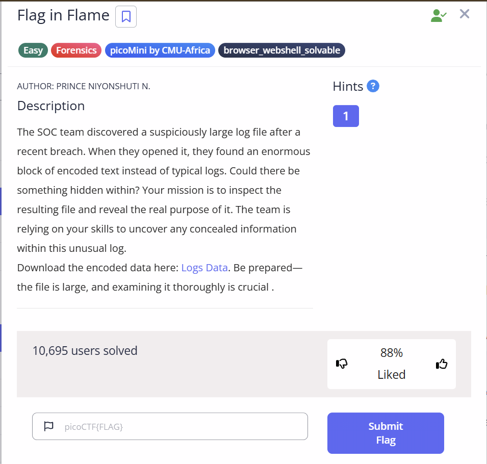

# Riddle Registry

## Challenge Description

## Solution

The challenge gaves us a file called "Confidential.pdf".

The file content are nothing but a random story anf gibberish text in latin.

I tried to copy and pasted the hidden text and found texts like : "The author had done a great and good job" and "No Flag here"

I then checked the question again and saw that it says something about Metadata.

So I searched in google for a website and i came across one called Metadata.com. This is a website for uploading any files and to find out the file contents like author, checksum, etc.

After i upload the file in that website, I found out that the authors name is is in a Base64 format.

I copied the text and went to Chatgpt to decrypt it, I got the FLAG!!!!!!!

