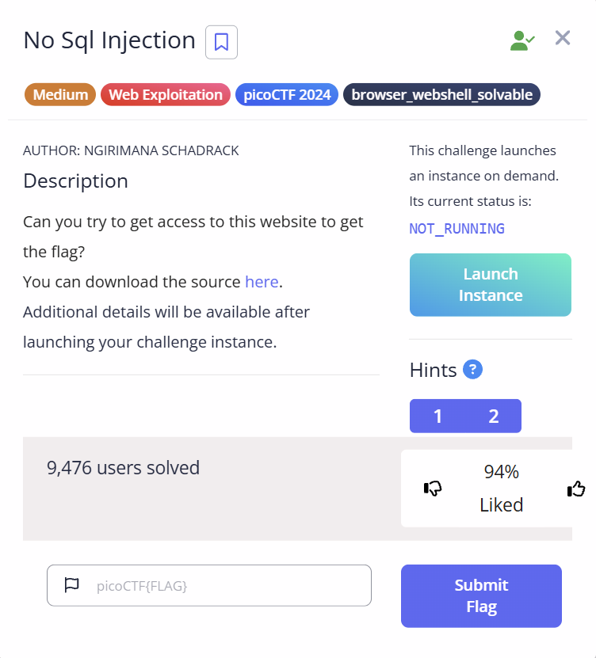
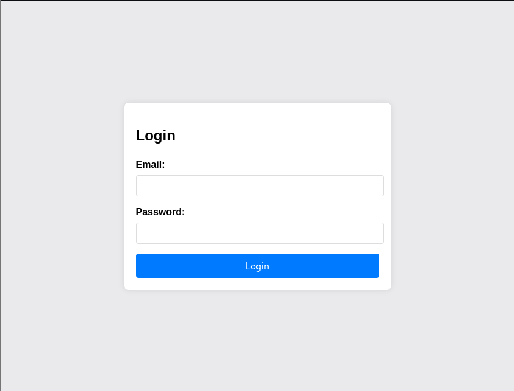

# 3V@L

## Challenge Description

## Solution

We are shown a Bank Loan Calculator Page. The first thing I did was inspect the page to find out if there was any hidden information or something useful

In the inspect part, I found out that the page uses REGEX to prevent encoding of the payloads. I also found out that the page prevents the use of some words when entering it as input.

I didnt paid attention and encoded the XSS payload in base64 format and sent it as the input.

Obviously, I got an error, but.....Instead of the normal " Input invalid " error, I got a Python EOL error instead. This gave me a clue that the backend is not proper.

I then checked out the question again and it told me something about "eval" function. I then searched in google and used AI to craft for me a payload to exploit this "eval function" vulnerability.

I then submitted the payload as input to the page. And VOILA!!!! the flag is being revealed

