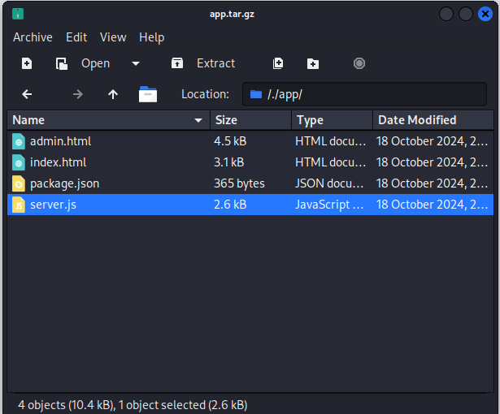
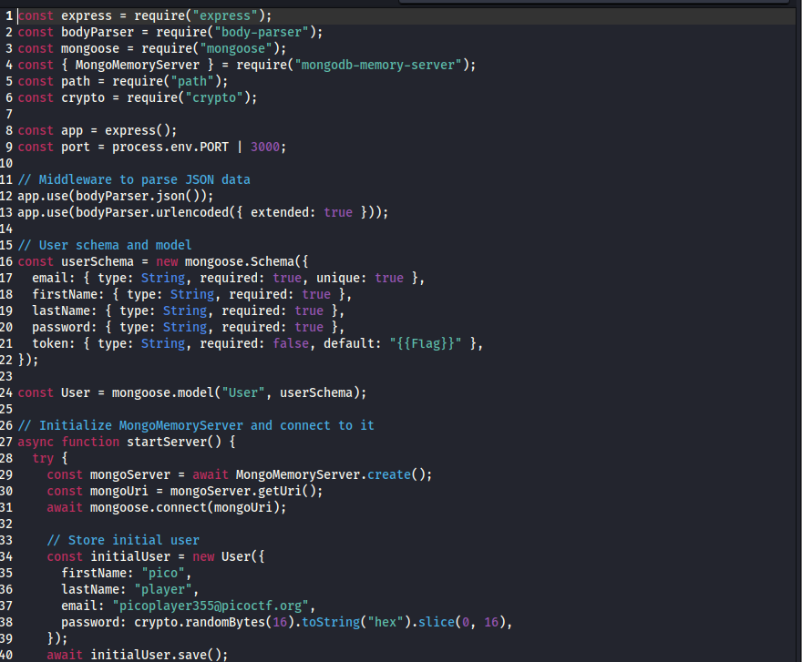
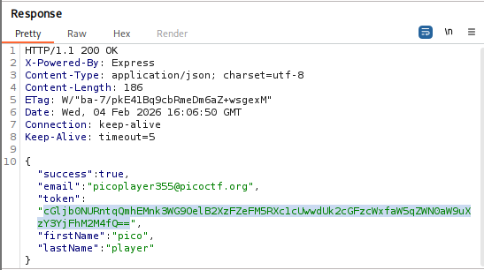
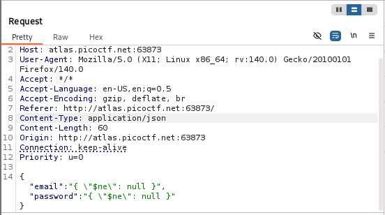
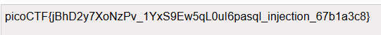

# No SQL Injection

## Challenge Description

## Solution

This challenge provided us with 2 things: 
1. A login page
2. A folder containing various files like html, css, javascript files as well as the backend files for the website.

I inspected all the files in that folder. What i found interesting was the backend file.

I didnt paid attention and encoded the XSS payload in base64 format and sent it as the input.

Obviously, I got an error, but.....Instead of the normal " Input invalid " error, I got a Python EOL error instead. This gave me a clue that the backend is not proper.

I then checked out the question again and it told me something about "eval" function. I then searched in google and used AI to craft for me a payload to exploit this "eval function" vulnerability.

I then submitted the payload as input to the page. And VOILA!!!! the flag is being revealed

